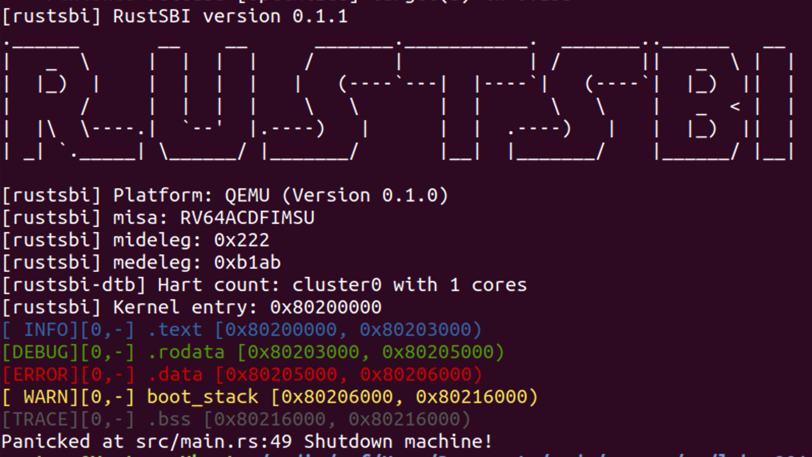

# lab1

计83 2018011334 谢云桐

## 编程内容

首先我参考 [rcore](https://github.com/rcore-os/rCore/blob/master/kernel/src/logging.rs)  实现了 `Logger`（基本只是去除了其中处理多线程的代码），可以用各种颜色输出不同等级的日志，并且在  `rust_main` 中引入 `crate log`，`logging::init()` 后以不同的等级输出系统信息。

## 截图

## 问答题

### 1

为了方便 os 处理，Ｍ态软件会将 S 态异常/中断委托给 S 态软件，请指出有哪些寄存器记录了委托信息，rustsbi 委托了哪些异常/中断？（也可以直接给出寄存器的值）

RISC-V 中 `midleg` 和 `medley` 分别委托异常和中断。

从上图可以看出，二者值分别为 `0x222, 0xb1ab`，这代表 S 时钟中断、外部中断、软件中断以及未对其异常、断点异常、页缺失、访问异常、U 系统调用被委托

## 2

请学习 gdb 调试工具的使用(这对后续调试很重要)，并通过 gdb 简单跟踪从机器加电到跳转到 0x80200000 的简单过程。只需要描述重要的跳转即可，只需要描述在 qemu 上的情况。

进入 qemu 后，pc 初始值 `0x100`，之后跳转到 `0x80000000` 的 RustSBI `start` 函数，之后阅读 RustSBI 代码，可知再跳转至 `0x80200000` 进入 rCOre