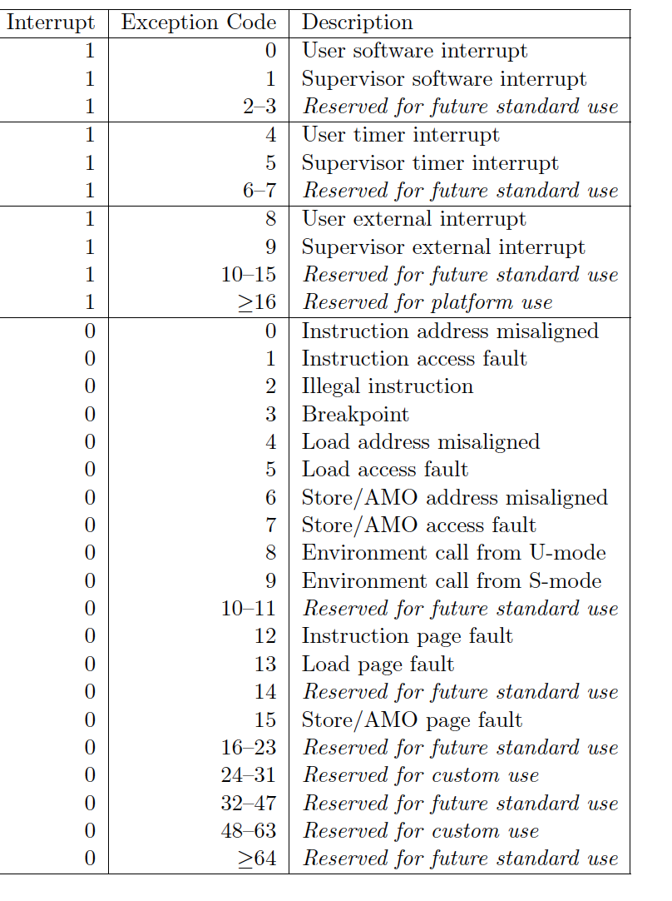

# lab1

计83 2018011334 谢云桐


## 编程内容

只需要添加一个判断内存访问权限的函数 `user_addr` 即可。另外我将示例代码中的 `println!` 全改成了 `log::` 以利用 lab1 的成功


## 问答题

### 1

正确进入 U 态后，程序的特征还应有：使用 S 态特权指令，访问 S 态寄存器后会报错。目前由于一些其他原因，这些问题不太好测试，请同学们可以自行测试这些内容（参考 [前三个测例](https://github.com/DeathWish5/rCore_tutorial_tests/tree/master/user/src/bin) )，描述程序出错行为，同时注意注明你使用的 sbi 及其版本。

我使用了 `RustSBI version 0.2.0-alpha.1`，输出如下：

```bash
[ INFO][0,-] [kernel] Loading app_0
scause=0x2
[ERROR][0,-] [kernel] IllegalInstruction in application, core dumped.
[ INFO][0,-] [kernel] Loading app_1
scause=0x2
[ERROR][0,-] [kernel] IllegalInstruction in application, core dumped.
[ INFO][0,-] [kernel] Loading app_2
[ERROR][0,-] [kernel] PageFault in application, core dumped.
```

三个测例的出错行为分别为非法指令（`sret`）、非法指令（`csrr`）、页错误（访问 `0x0`）。这些错误都由硬件发现后调用 `trap_handler` 捕获。


## 2

请结合用例理解 [trap.S](https://github.com/rcore-os/rCore-Tutorial-v3/blob/ch2/os/src/trap/trap.S) 中两个函数 `__alltraps` 和 `__restore` 的作用，并回答如下几个问题:

1. L40: 刚进入 `__restore` 时，`a0` 代表了什么值。请指出 `__restore` 的两种使用情景。

   `a0` 为上下文 `TrapContext` 的地址（位于内核栈顶）。`__restore` 会在 `run_next_app`中用来初始化上下文（`a0` 是参数）和 `__alltraps` 中用来恢复上下文（`a0` 是 `trap_handler` 的返回值） 

2. L46-L51: 这几行汇编代码特殊处理了哪些寄存器？这些寄存器的的值对于进入用户态有何意义？请分别解释。

   ```
   ld t0, 32*8(sp)
   ld t1, 33*8(sp)
   ld t2, 2*8(sp)
   csrw sstatus, t0
   csrw sepc, t1
   csrw sscratch, t2
   ```

   `sstatus, sepc, sscratch`。

   - `sstatus`：`SPP` 等字段给出 Trap 发生之前 CPU 处在哪个特权级（S/U）等信息
   - `spec`: 进入用户态的初始 `PC`
   - `sscratch`：用户栈顶

3. L53-L59: 为何跳过了 `x2` 和 `x4`？

   ```
   ld x1, 1*8(sp)
   ld x3, 3*8(sp)
   .set n, 5
   .rept 27
      LOAD_GP %n
      .set n, n+1
   .endr
   ```

   `x2` 是 `sp`，指向内核态栈顶，它是一系列操作的基址不能变，在 L63 从 `sscratch` 中恢复。`x4` 是 `tp`，一般不会用到，也没有保存

4. L63: 该指令之后，`sp` 和 `sscratch` 中的值分别有什么意义？

   ```
   csrrw sp, sscratch, sp
   ```

   `sp` 为用户态栈顶，`sscratch` 为内核态栈顶。`sp` 是 U 态上下文的一部分内容，`sscratch` 则是保证下一次陷入时可以得到内核态栈地址

5. `__restore`：中发生状态切换在哪一条指令？为何该指令执行之后会进入用户态？

   L64 `sret`。它会改变 `pc` 和 `sstatus`，同时硬件根据 `SPP` 得知之后进入用户态

6. L13： 该指令之后，`sp` 和 `sscratch` 中的值分别有什么意义？

   ```
   csrrw sp, sscratch, sp
   ```

   `sp` 为内核栈顶，`sscratch` 为用户栈顶

7. 从 U 态进入 S 态是哪一条指令发生的？

   不在 `trap.S` 中，而是在用户程序 `ecall` 或者指令执行出错时发生。这条指令的地址被保存在 `sepc`（在 `trap_handler` 中可能被改变）


### 3

程序陷入内核的原因有中断和异常（系统调用），请问 riscv64 支持哪些中断 / 异常？如何判断进入内核是由于中断还是异常？描述陷入内核时的几个重要寄存器及其值。

中断/异常如下图：



根据 `Interrupt` 位判断。

`xstatus`：机器状态信息

`xedeleg`：异常委托

`xideleg`：中断委托

`xie`：中断使能

`xtvec`：陷入内核时跳转地址

`xscratch`：临时寄存器

`xepc`：发生异常的指令

`xcause`：异常类型

`xtval`：错误指令/地址

`xip`：pending 中断

`x` 为 `s/m` 

### 4

对于任何中断， `__alltraps` 中都需要保存所有寄存器吗？你有没有想到一些加速 `__alltraps` 的方法？简单描述你的想法。

不一定。对于一些不会恢复到原来状态的情况，比如程序发生无法处理的错误或强制终止程序，自然不需要保存寄存器。

进入 `__alltraps` 时先检查 `scause`，如果属于上面所说的情况则不保存上下文，直接进入内核态。